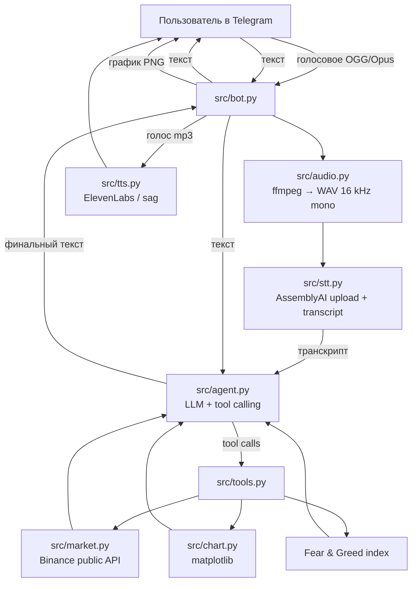

# Архитектура

## Решения и почему так

**Файловое распознавание, а не стриминг.** Telegram отдаёт голосовое сообщение целиком
файлом — стримить нечего. AssemblyAI `/v2/upload` + `/v2/transcript` даёт точный текст
с пунктуацией и авто-определением языка. Стриминговый путь (`wss://streaming.assemblyai.com/v3/ws`)
нужен для «живого» микрофона и оставлен как расширение, а не основной сценарий.

**Авто-определение языка.** `language_detection: true` — пользователь говорит по-русски
или по-английски, переключать ничего не нужно.

**Инструменты вместо жёстких промптов.** Модель сама решает, что ей нужно: цена, индикаторы,
снимок рынка, индекс страха и жадности или график. Это позволяет задавать вопросы вида
«сравни эфир и солана» без отдельного кода под каждый сценарий.

**Ответ быстрый и «устный».** Системный промпт требует 2–5 коротких предложений без
markdown: длинный ответ с озвучкой превращается в минуту прослушивания.

**Устойчивость.** Ошибка любого инструмента возвращается модели как JSON с `error`,
она объясняет проблему пользователю вместо падения бота. Нет ключа AssemblyAI —
пайплайн можно гонять на локальном `whisper` (`STT_MODE=whisper`).

## Поток данных на примере

Пользователь: голосовое «Что с биткоином на часовом? Покажи график.»

1. `bot.on_voice` скачивает `.ogg`, `audio.to_wav16k` → WAV 16 kHz.
2. `stt.transcribe` → `{"text": "Что с биткоином на часовом? Покажи график.", "language": "ru"}`.
3. `agent.answer` отправляет текст в LLM с описанием пяти инструментов.
4. LLM просит `get_indicators(BTC, 1h)` → получает строку с ценой, SMA20, RSI, BB, объёмом.
5. LLM просит `make_chart(BTC, 1h)` → `chart.make_chart` сохраняет PNG.
6. LLM отдаёт финальный текст → `bot` отвечает текстом, фото и голосовым сообщением.

## Ограничения текущей версии

- нет потокового распознавания (микрофон в реальном времени) — только голосовые сообщения;
- нет учёта портфеля пользователя (только публичные рыночные данные);
- TTS синтезирует ответ целиком, без стриминга по предложениям.
